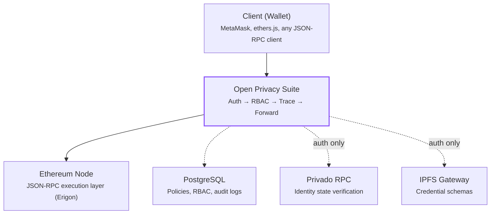
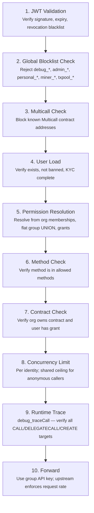
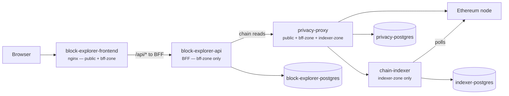

import { Callout } from "@/components/mdx/callout";

export const metadata = {
  title: "Architecture",
  description:
    "System architecture overview of the Open Privacy Suite, a privacy-preserving JSON-RPC proxy for Ethereum nodes.",
};

# Architecture

Open Privacy Suite is a privacy-preserving JSON-RPC proxy that sits between clients and an Ethereum node, enforcing ZK-proof authentication and multi-tenant RBAC.

## System Overview

The proxy is the **sole gateway** between clients and the blockchain. There are no alternative paths to the Ethereum node. If the proxy denies access, the user has no way to reach the network.

## Core Components

| Component | Description |
|-----------|-------------|
| **Authentication** | Privado ID ZK proofs for privacy-preserving identity verification, plus Azure AD / Microsoft Entra ID for enterprise SSO |
| **Authorization** | Multi-tenant RBAC with org, group (flat, multi-membership), and user-level permissions. Method-level, contract-level, and function selector restrictions |
| **Proxy** | JSON-RPC forwarding with security filtering, batch rejection, and multicall detection |
| **Runtime Tracing** | `debug_traceCall` simulation of every transaction to validate all internal call targets before forwarding |
| **Traffic protection** | Upstream RPC-proxy rate tiers selected by per-group API keys, plus local per-user/shared-anonymous concurrency ceilings and a per-key circuit breaker |
| **Compliance** | Travel rule enforcement, multi-currency token pricing, and selective disclosure system |

## Request Flow

Every JSON-RPC request passes through the following pipeline:

1. **JWT Validation** -- Verify the access token signature, expiry, and check the revocation blacklist.
2. **Global Blocklist Check** -- Reject dangerous methods (`debug_*`, `admin_*`, `personal_*`, `miner_*`, `txpool_*`, etc.) regardless of user permissions.
3. **Multicall Check** -- Block calls to known Multicall contract addresses that could batch unauthorized operations.
4. **User Load** -- Look up the user record. Verify the user exists, is not banned, and has completed KYC. (The chain-metadata methods on the anonymous allowlist — `eth_blockNumber`, `eth_chainId`, etc. — are exempt from the KYC gate: anonymous callers get them without any account.)
5. **Permission Resolution** -- Resolve effective permissions from the user's org memberships, group memberships (flat — UNION across all groups), and contract grants (cached).
6. **Method Check** -- Verify the requested JSON-RPC method is in the user's allowed methods.
7. **Contract Check** -- If the call targets a contract, verify the user's org owns it and the user has an appropriate grant.
8. **Concurrency Limit** -- Acquire the caller's local in-flight slot. Authenticated callers are limited per identity; anonymous callers share one aggregate ceiling.
9. **Runtime Trace** -- Simulate the transaction via `debug_traceCall`. Extract all `CALL`, `DELEGATECALL`, `STATICCALL`, and `CREATE`/`CREATE2` targets. Verify every target belongs to the user's org, is a precompile, or is shared infrastructure.
10. **Forward** -- Send the validated request with the resolved group or fallback API key. The upstream RPC proxy owns request-rate quotas; privacy-proxy's per-key circuit breaker sheds requests after an upstream `429`.

## Data Flow for Transactions

## Service Ports

| Service | Default Port | Description |
|---------|-------------|-------------|
| Open Privacy Suite (API + RPC) | `8080` | JSON-RPC proxy and admin REST API |
| Frontend (Admin UI) | `5173` | Vite dev server for the admin dashboard |
| PostgreSQL | `5432` | Policy storage, RBAC, audit logs |
| Ethereum Node (Anvil/Erigon) | `8545` | JSON-RPC execution layer |

## Privacy-mode topology

In privacy mode the deployment adds a block-explorer fronted by a BFF (Backend-for-Frontend) and a chain-indexer feeding the BFF. The compose manifest splits the trust surface into two internal Docker networks plus a public one — `privacy-proxy` is the only legitimate bridge between them.

Key invariants:

- **`indexer-zone`** holds the chain-indexer and its postgres. Only `privacy-proxy` attaches to this network.
- **`bff-zone`** holds the block-explorer BFF and its postgres. `privacy-proxy` and the explorer-frontend (for nginx upstream resolution) attach here.
- **`public`** carries browser ingress only — `privacy-proxy` (port `8080`), `privacy-proxy` frontend (port `5173`), and `block-explorer-frontend` (port `3001`).
- The BFF is built with the `privacy` Go build tag — the chain-indexer client is compiled out entirely, so even if a future env-var override sets `INDEXER_URL`, the BFF cannot reach `chain-indexer`. A static manifest test enforces by name that no other service may attach to both `indexer-zone` and `bff-zone` at once.

The prod compose (`docker-compose.privacy.yml`) pulls the proxy and chain-indexer as published images rather than building from source; the dev compose (`docker-compose.privacy.dev.yml`) builds the proxy locally and pulls the chain-indexer.

## Key Directories

| Directory | Purpose |
|-----------|---------|
| `internal/auth` | Privado ID ZK-proof verification, Azure AD SSO, mock verifiers |
| `internal/rbac` | Access control engine: permission resolution, contract grants, cross-org isolation |
| `internal/server` | HTTP handlers, JSON-RPC processor, middleware, admin API |
| `internal/proxy` | JSON-RPC forwarding, batch rejection, request size limits |
| `internal/db` | PostgreSQL access via pgx v5, migrations (tern), data models |
| `internal/compliance` | Travel rule enforcement, multi-currency pricing, CoinGecko integration |
| `internal/config` | Environment variable loading and validation |

## Further Reading

- [Authentication](/docs/authentication) -- ZK-proof and Azure AD authentication flows
- [RBAC](/docs/rbac) -- Hierarchical role-based access control
- [Security](/docs/security) -- Runtime tracing, cross-org isolation, threat model
- [Deployment](/docs/deployment) -- Smart contract deployment workflows
- [Disclosure](/docs/disclosure) -- Selective disclosure system
- [API Reference](/docs/api) -- Full REST and JSON-RPC endpoint documentation
