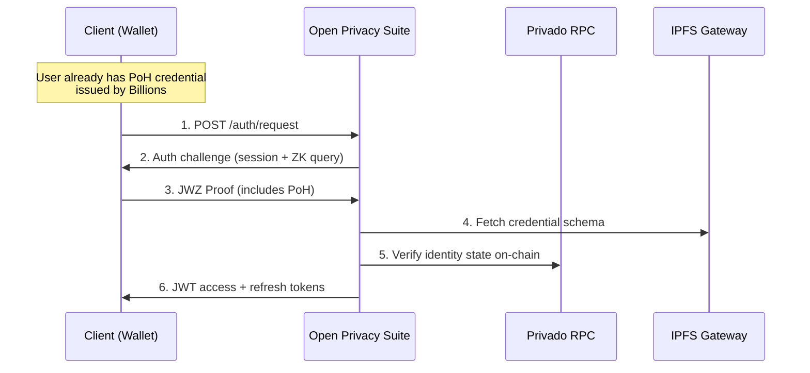

import { Callout } from "@/components/mdx/callout";
import { ApiEndpoint } from "@/components/mdx/api-endpoint";
import { EnvTable } from "@/components/mdx/env-table";
import { Step } from "@/components/mdx/step";
export const metadata = {
  title: "Authentication",
  description:
    "ZK-proof authentication via Privado ID with optional ProofOfHumanity verification and Azure AD SSO.",
};

# Authentication

## Overview

The Open Privacy Suite authenticates users through **Privado ID zero-knowledge proofs** with optional
**ProofOfHumanity (PoH)** verification via Billions. Users prove their identity without revealing
private keys, and can optionally link Ethereum addresses via EIP-191 signatures.

For SSO-based authentication using Microsoft Entra ID, see the [Azure AD / SSO](/docs/azure-ad) guide.

## Architecture



## Auth Flow

<Step number={1} title="Client requests auth challenge">

`POST /auth/request` -- the client initiates authentication by requesting a Privado ID
authorization challenge. The server generates a session ID, creates an authorization request
with a ProofOfHumanity ZK query (if enabled), and returns both to the client.

When `RequireProofOfHumanity` is enabled the request includes a ZK query:

```json
{
  "id": 1,
  "circuitId": "credentialAtomicQueryMTPV2",
  "query": {
    "allowedIssuers": ["did:polygonid:polygon:amoy:..."],
    "credentialSubject": { "isHuman": { "$eq": 1 } },
    "context": "https://raw.githubusercontent.com/0xPolygonID/tutorial-examples/main/credential-schema/schemas-examples/proof-of-humanity/proof-of-humanity.jsonld",
    "type": "ProofOfHumanity"
  }
}
```

</Step>

<Step number={2} title="Wallet generates ZK proof">

The client's Privado wallet creates a **JWZ (JSON Web Zero-knowledge)** token that:

- Proves DID ownership without revealing private keys
- Proves possession of a ProofOfHumanity credential (`isHuman=1`)
- Is cryptographically bound to the authorization request
- Cannot be replayed to other verifiers

</Step>

<Step number={3} title="Client submits proof">

The proof is submitted to one of two endpoints:

<ApiEndpoint method="POST" path="/auth/callback?session={session_id}" description="Wallet callback -- the standard flow" />
<ApiEndpoint method="POST" path="/auth/verify" description="Manual submission (development only)" />

The server retrieves the session, extracts and verifies the JWZ token against the original
auth request, checks the PoH credential (if required), and extracts the user DID.

</Step>

<Step number={4} title="JWT tokens issued (or rejection)">

On success the server returns an access/refresh token pair:

```json
{
  "access_token": "eyJhbGc...",
  "refresh_token": "eyJhbGc...",
  "token_type": "Bearer",
  "expires_in": 1800
}
```

If the user lacks a valid ProofOfHumanity credential the server responds with **403 Forbidden**:

```json
{
  "error": "humanity_verification_required",
  "message": "Please complete ProofOfHumanity verification at Billions",
  "verify_url": "https://app.billions.network"
}
```

</Step>

---

## ETH Address Linking

Users can link Ethereum addresses to their DID. There are two link types:

- **User-initiated link** (`link_type: user`) — the user proves ownership by signing an EIP-191 challenge. This is the explicit, user-controlled flow.
- **System-inferred link** (`link_type: system`) — when a user submits a signed transaction (`eth_sendRawTransaction`) and the proxy forwards it successfully, the sender address (cryptographically recovered from the transaction signature) is automatically linked to the user's DID. This enables response filters to recognise transactions without requiring a separate linking step.

User-initiated links take precedence over system-inferred links when both exist for the same address.

### User-Initiated Linking

<Step number={1} title="Request challenge">

<ApiEndpoint method="POST" path="/eth/link/challenge" description="Request a signing challenge (JWT required)" />

Returns a nonce and a human-readable message for the user to sign.

```json
{
  "nonce": "a1b2c3d4e5f6...",
  "message": "Link Ethereum address to DID\n\nI authorize linking this Ethereum address to my decentralized identity.\n\nDID: did:privado:...\nNonce: a1b2c3d4e5f6..."
}
```

</Step>

<Step number={2} title="Sign the message">

The user signs the message with their Ethereum wallet (MetaMask, etc.) using `personal_sign`.

</Step>

<Step number={3} title="Submit signature">

<ApiEndpoint method="POST" path="/eth/link/verify" description="Submit signed challenge (JWT required)" />

```json
{
  "nonce": "a1b2c3d4e5f6...",
  "address": "0x742d35Cc6634C0532925a3b844Bc9e7595f...",
  "signature": "0x..."
}
```

</Step>

<Step number={4} title="View or unlink addresses">

<ApiEndpoint method="GET" path="/eth/addresses" description="List linked addresses (JWT required)" />
<ApiEndpoint method="DELETE" path="/eth/addresses/:address" description="Unlink an address (JWT required)" />

</Step>

### Address Collision Detection

A single ETH address can be linked by more than one DID — for example, a shared deployer wallet used by a team, or a key-compromise event. When this occurs, the system:

1. **Allows the link** — shared keys are a legitimate pattern (multi-sig, shared deployer, team wallet).
2. **Emits a SIEM event** with elevated severity (`eth_address_linked_collision`) so administrators can review.
3. **Surfaces collisions in the admin dashboard** — administrators can view all addresses linked to multiple DIDs at `GET /api/v1/admin/eth-addresses/collisions`.

If a collision is judged to be a key-compromise event rather than intentional sharing, the administrator can revoke the unwanted link.

---

## Configuration

<EnvTable vars={[
  { name: "BILLIONS_ISSUER_DID", default: "(none)", description: "Billions issuer DID for PoH verification" },
  { name: "REQUIRE_PROOF_OF_HUMANITY", default: "true (prod) / false (dev)", description: "Enable or disable the PoH requirement" },
  { name: "PRIVADO_RPC_URL", default: "https://rpc-mainnet.privado.id", description: "Privado network RPC endpoint" },
  { name: "IPFS_GATEWAY", default: "https://ipfs-proxy-cache.privado.id", description: "IPFS gateway for credential schemas" },
  { name: "JWT_SECRET", default: "(auto-generated in dev)", description: "Access token signing secret" },
  { name: "JWT_REFRESH_SECRET", default: "(auto-generated in dev)", description: "Refresh token signing secret" },
  { name: "VERIFIER_ID", default: "(required in prod)", description: "DID of the verifier service" },
  { name: "BASE_URL", default: "http://localhost:8080", description: "Base URL used for callback URLs" },
  { name: "ENVIRONMENT", default: "development", description: "Set to production to disable /auth/verify endpoint" },
]} />

<Callout variant="warning" title="Production checklist">

Before deploying to production, ensure you have:

1. Set `BILLIONS_ISSUER_DID` to the production Billions issuer DID
2. Set `REQUIRE_PROOF_OF_HUMANITY=true`
3. Configured strong, unique `JWT_SECRET` and `JWT_REFRESH_SECRET`
4. Configured `VERIFIER_ID` with your service's DID
5. Set `BASE_URL` to your public URL
6. Set `ENVIRONMENT=production` (disables the `/auth/verify` endpoint)

</Callout>

---

## Testing Options

### Option A: Mock Implementation (Development)

Use the `MockPrivadoVerifier` for local development:

```bash
ENVIRONMENT=development
REQUIRE_PROOF_OF_HUMANITY=false
```

- Skips real ZK proof verification
- Returns configurable responses (`isHuman` true/false)
- Works without any external infrastructure
- Supports mock tokens: `mock.{did}` or `mock.jwz.token.{did}`

### Option B: Run Your Own Issuer Node (E2E Testing)

Run a local [Privado ID Issuer Node](https://github.com/0xPolygonID/issuer-node) on Polygon Amoy
testnet. Clone the repo, configure for Amoy, and create ProofOfHumanity credentials for test users.

**Amoy testnet details:**

| Parameter | Value |
|-----------|-------|
| State contract | `0x1a4cC30f2aA0377b0c3bc9848766D90cb4404124` |
| Chain ID | `80002` |
| Faucet | [Alchemy Polygon Amoy faucet](https://www.alchemy.com/faucets/polygon-amoy) |

Then configure the proxy:

```bash
BILLIONS_ISSUER_DID=did:polygonid:polygon:amoy:...
REQUIRE_PROOF_OF_HUMANITY=true
```

### Option C: Billions Testnet

Billions is in early alpha. Check [Billions signup](https://signup.billions.network/) for testnet
access and their Discord for developer API access.

### Testing Matrix

| Scenario | Implementation | Config |
|----------|---------------|--------|
| Unit tests | MockPrivadoVerifier | `REQUIRE_PROOF_OF_HUMANITY=false` |
| Dev local | MockPrivadoVerifier | `REQUIRE_PROOF_OF_HUMANITY=false` |
| E2E Amoy | Real verifier + own issuer | `BILLIONS_ISSUER_DID=did:polygonid:...` |
| Production | Real verifier + Billions | `BILLIONS_ISSUER_DID=<billions-prod-did>` |

---

## Admin Authentication

Admin API endpoints (`/api/v1/admin/*`) use a separate authentication layer from the user auth flow described above. The admin middleware accepts two credential types:

### X-Admin-Token (M2M / Bootstrap)

For machine-to-machine access and initial setup. Set via the `ADMIN_API_TOKEN` environment variable and passed in the `X-Admin-Token` request header.

```bash
curl -H "X-Admin-Token: $ADMIN_API_TOKEN" \
  http://localhost:8080/api/v1/admin/orgs
```

### JWT with Admin Claim (Browser-Based)

For admin dashboard access. Users authenticate normally (Privado ID or Azure AD), then the middleware checks whether the user has the `admin` RBAC claim via any of their group memberships. The check filters out expired memberships.

To grant admin access to a user:

1. Create an organization and group via the admin API (using X-Admin-Token)
2. Set the `admin` claim on the group's access configuration
3. Add the user as a member of that group

<Callout variant="info" title="Dev mode shortcut">
  In development builds, mock-login users are automatically granted the `admin` claim on first login. No manual RBAC setup is needed — click the flask icon and access the admin dashboard immediately.
</Callout>

The frontend checks admin status via `GET /api/v1/me/admin-status` (returns `{ "is_admin": true/false }`). Non-admin users see an "Access Denied" page; unauthenticated users are redirected to login.

See [docs/admin-auth-bootstrap.md](https://github.com/gateway-fm/privacy-proxy/blob/main/docs/admin-auth-bootstrap.md) for a step-by-step bootstrap guide.

---

## Error Reference

### Authentication Errors

| Status | Error | Cause |
|--------|-------|-------|
| 400 | `session parameter required` | Missing session ID in callback |
| 400 | `jwz_token required` | Missing proof token |
| 401 | `session not found or expired` | Invalid or expired session (10 min TTL) |
| 401 | `JWZ verification failed` | Invalid ZK proof |
| 403 | `humanity_verification_required` | User lacks PoH credential |
| 500 | `VERIFIER_ID not configured` | Missing configuration |

### ETH Linking Errors

| Status | Error | Cause |
|--------|-------|-------|
| 400 | `invalid or expired nonce` | Challenge expired (5 min TTL) |
| 400 | `signature verification failed` | Signature does not match address |
| 403 | `challenge does not belong to this user` | Wrong user for challenge |
| 404 | `address not found` | Address not linked to user |

### Access Control Errors

| Status | Error | Cause |
|--------|-------|-------|
| 401 | `missing Authorization header` | No Bearer token provided |
| 401 | `invalid token` | Malformed or invalid JWT |
| 403 | `user is banned` | User's policy has `banned: true` |
| 403 | `KYC required` | User's policy has `kyc: false` |
| 403 | `method not allowed` | Method not in user's `allow_methods` |
