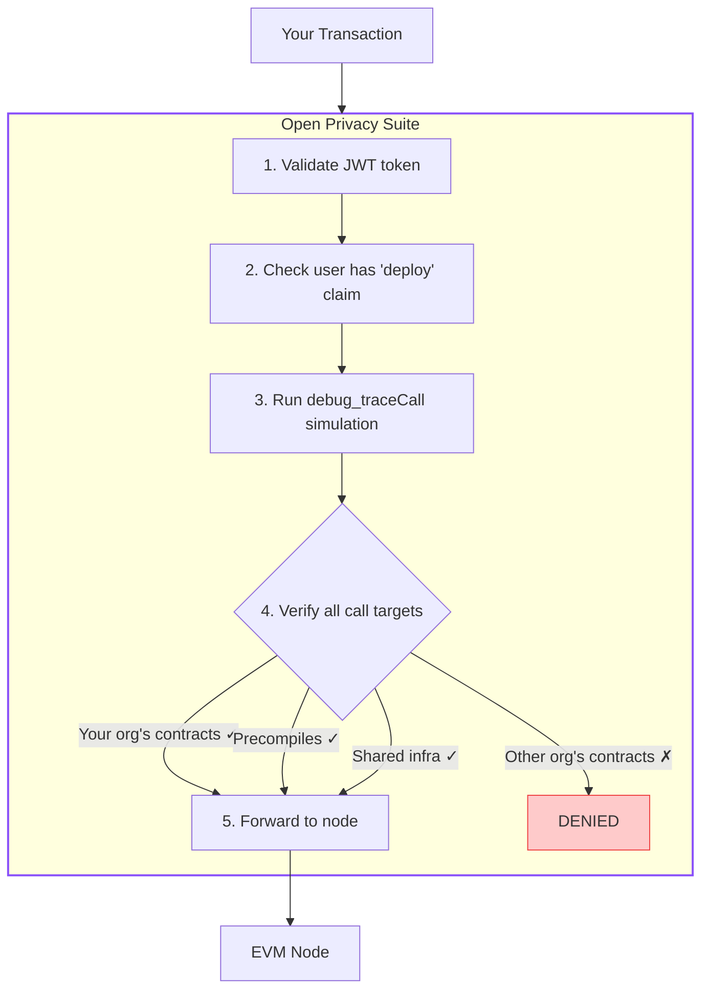

import { Callout } from "@/components/mdx/callout";
import { Step } from "@/components/mdx/step";
export const metadata = {
  title: "Contract Deployment",
  description:
    "How to deploy smart contracts through the Open Privacy Suite using runtime tracing.",
};

# Contract Deployment

This guide describes how to deploy smart contracts through the Open Privacy Suite. The proxy validates all transactions at runtime using `debug_traceCall`, so deploying is nearly identical to deploying on any public chain.

### Prerequisites

- User account with `deploy` permission in an organization
- JWT access token (obtained from web UI after ZK proof authentication)
- Foundry or Hardhat installed

### Steps

<Step number={1} title="Get Your Access Token">

Open the Open Privacy Suite web UI (e.g., `http://localhost:5173`), authenticate with your Privado ID wallet (scan QR code), then go to **Settings** > **Developer** > **Copy Access Token**.

</Step>

<Step number={2} title="Configure Your Environment">

```bash
# Set the authorization header for all RPC requests
export ETH_RPC_HEADERS="Authorization: Bearer YOUR_JWT_TOKEN_HERE"

# Set the RPC URL
export ETH_RPC_URL="http://localhost:8080/rpc"
```

</Step>

<Step number={3} title="Deploy with Foundry">

```bash
# Standard Foundry deployment -- no changes needed
forge script script/Deploy.s.sol \
  --rpc-url $ETH_RPC_URL \
  --broadcast \
  --private-key $PRIVATE_KEY
```

Or with a keystore:

```bash
forge script script/Deploy.s.sol \
  --rpc-url $ETH_RPC_URL \
  --broadcast \
  --account myKeystore \
  --sender 0xYourAddress
```

</Step>

### Deploy with Hardhat (Alternative)

```javascript
// hardhat.config.js
module.exports = {
  networks: {
    privacy: {
      url: process.env.ETH_RPC_URL,
      httpHeaders: {
        "Authorization": `Bearer ${process.env.PRIVACY_TOKEN}`
      },
      accounts: [process.env.PRIVATE_KEY]
    }
  }
};
```

```bash
export PRIVACY_TOKEN="YOUR_JWT_TOKEN_HERE"
npx hardhat run scripts/deploy.js --network privacy
```

### Deploy with Cast (Alternative)

```bash
# Single contract deployment
cast send --create \
  --rpc-url $ETH_RPC_URL \
  --private-key $PRIVATE_KEY \
  $(cat out/MyContract.sol/MyContract.bin)
```

## How It Works

When you send a transaction through the proxy:



### Auto-Registration After Deployment

Contracts deployed through the proxy are **automatically registered** in the RBAC system. No manual registration step is required.

**Prerequisites:** The deployer must be a member of a group with the `deploy` claim in their org. An admin creates this group and adds deployers to it before they start deploying.

**Plain CREATE deployments** (`eth_sendTransaction` without `to`):

1. Proxy verifies the user has the `deploy` claim (403 if not).
2. Proxy computes the deterministic CREATE address from `keccak256(rlp([sender, nonce]))` _before_ forwarding.
3. Address is immediately pre-registered to the deployer's org (closes the cross-org access window).
4. Transaction is forwarded to the node.
5. On successful mining: pre-registration is finalized as a full `Contract` record (`auto_registered: true`, `via: plain_create`). A `contract_grant` is added to the deployer's existing deploy group — no new group is created.
6. On revert: pre-registration is cleaned up.

## Token Refresh

Access tokens expire after 30 minutes. To refresh:

```bash
# Get a new token from the web UI, or use the refresh endpoint:
curl -X POST http://localhost:8080/refresh \
  -H "Content-Type: application/json" \
  -d '{"refresh_token": "YOUR_REFRESH_TOKEN"}'

# Update your environment
export ETH_RPC_HEADERS="Authorization: Bearer NEW_ACCESS_TOKEN"
```

## Troubleshooting

| Error | Cause | Solution |
|-------|-------|----------|
| `401 Unauthorized` | Invalid or expired token | Get a new token from the web UI |
| `403 Forbidden: deploy claim required` | User lacks deploy permission | Ask org admin to grant `deploy` claim |
| `403 Forbidden: cross-org access denied` | Contract calls another org's contract | Only interact with your org's contracts |
| `403 Forbidden: method not allowed` | Method not in user's allowlist | Check group permissions |

## Security Model

| Layer | Check | Timing |
|-------|-------|--------|
| Plain CREATE Pre-reg | CREATE address pre-registered before tx forwarded | Deploy |
| Auto-Registration | Contract added to RBAC after mine | Deploy |
| Runtime Calls | All call targets authorized | Every tx |

- **Cross-org calls**: Contract in Org A cannot call contract in Org B.
- **Intra-org calls**: Contracts within the same org can call each other freely.
- **Shared infrastructure**: Approved shared contracts accessible to all orgs.
- **Precompiles**: Standard EVM precompiles (`0x01`--`0x09`) are always allowed.

---

## Production Deployment

This section covers production hardening considerations beyond contract deployment. For the full production checklist, see [Security](/docs/security#production-checklist). For environment variable reference, see [Configuration](/docs/configuration).

### HTTPS and Private Networks

The proxy enforces HTTPS for the `BASE_URL` in production (`ENVIRONMENT=production`). However, **private network addresses are exempt** from this requirement -- HTTP is allowed when the proxy is accessed over:

- RFC1918 private addresses (`10.0.0.0/8`, `172.16.0.0/12`, `192.168.0.0/16`)
- Tailscale addresses (`100.64.0.0/10`)
- IPv6 Unique Local Addresses (ULA, `fd00::/8`)

This allows local and VPN-based development/staging environments to run without TLS while still enforcing HTTPS for internet-facing deployments.

### Frontend in Production

In production, the admin frontend is served by **nginx** (not the Vite development server). The nginx container listens on port 80 internally and serves the pre-built static assets. The production Docker Compose file configures this automatically. Do not use the Vite dev server (`proxy-frontend` on port 5173) in production -- it is not designed for production traffic and exposes debugging features.

### Explorer Database Graceful Degradation

The backend starts successfully even if the explorer database is unavailable. When the explorer DB connection fails at startup, the backend logs a warning and continues serving all non-explorer endpoints. A background goroutine retries the explorer DB connection every 30 seconds. Explorer API endpoints return appropriate errors until the connection is established.

This prevents the entire proxy from failing to start due to an optional dependency and supports deployment scenarios where the explorer database is provisioned after the proxy.

### GIN\_MODE

