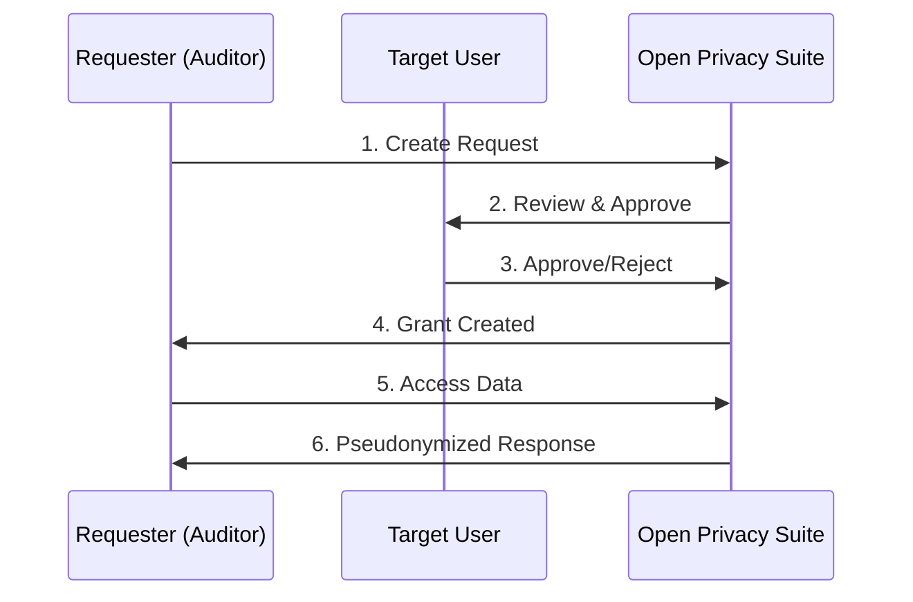
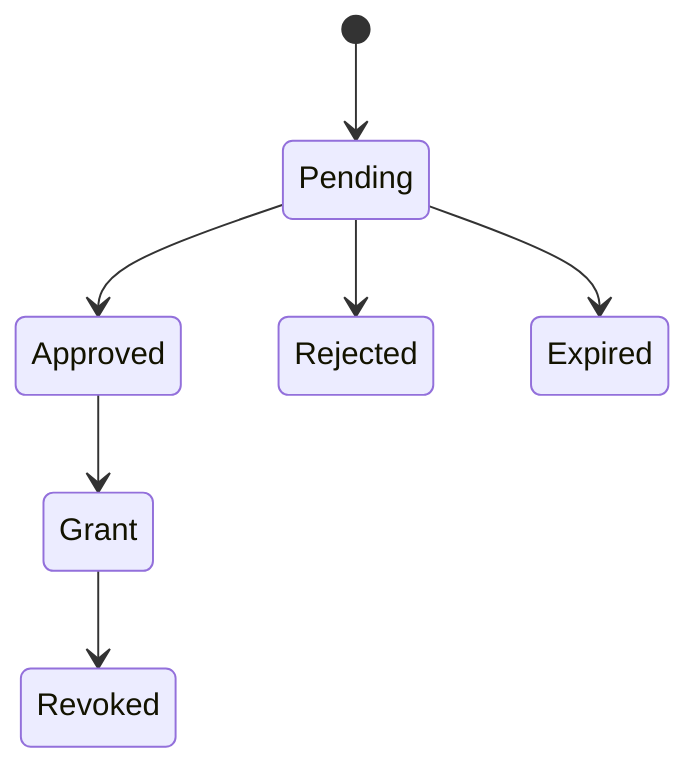

import { Callout } from "@/components/mdx/callout";
import { ApiEndpoint } from "@/components/mdx/api-endpoint";
import { EnvTable } from "@/components/mdx/env-table";
export const metadata = {
  title: "Selective Disclosure",
  description:
    "Selective disclosure system for sharing address visibility with auditors and regulators while maintaining privacy controls.",
};

# Selective Disclosure

The Open Privacy Suite implements a selective disclosure system that allows users to share address visibility with authorized parties (auditors, regulators, compliance teams) while maintaining privacy controls.

## Overview

The disclosure system provides:

- **Granular control** over what data is shared and how addresses are displayed
- **Time-limited access** with automatic expiration
- **Audit trail** of all disclosure access events
- **Multiple disclosure levels** from full transparency to complete redaction

## Disclosure Levels

| Level | Address Display | Use Case |
|-------|-----------------|----------|
| **Full** | Real addresses (`0xa32c...94cd`) | Regulatory subpoenas, law enforcement investigations |
| **Pseudonymous** | Consistent pseudonyms (`Address-KDCM`) | Financial audits -- allows pattern analysis without revealing identity |
| **Redacted** | Uniform `[PRIVATE]` placeholder for every address | Proof of activity -- timing, direction, gas, status visible, but no counterparty correlation across transactions |

The three levels form a privacy ladder:

- **Full** = identity + transaction graph.
- **Pseudonymous** = transaction graph without identity (same address renders as the same pseudonym within a grant, so patterns are visible).
- **Redacted** = volume and timing without graph (every address renders as the same placeholder, so the auditor cannot correlate counterparties between transactions). `value` is also withheld at this level; transaction hashes are never returned.

Activity log access (RPC method invocations as proof of activity, without addresses or parameters) is **orthogonal** to disclosure level — it is granted via the `activity_logs` or `full_disclosure` scope on the grant, not by the disclosure level.

## Workflow



## Data Models

### Disclosure Request

A request from an authorized party to view someone's data:

```json
{
  "id": "550e8400-e29b-41d4-a716-446655440000",
  "requester_did": "did:iden3:privado:main:2SaubQ6...",
  "target_user_id": "user-123",
  "org_id": "org-456",
  "scope": {
    "addresses": ["0xa32c..."],
    "date_range": {
      "start": "2024-01-01T00:00:00Z",
      "end": "2024-12-31T23:59:59Z"
    },
    "disclosure_level": "pseudonymous"
  },
  "reason": "Annual financial audit",
  "legal_basis": "GDPR Article 6(1)(c)",
  "status": "pending",
  "requested_at": "2024-06-15T10:30:00Z",
  "expires_at": "2024-06-22T10:30:00Z"
}
```

### Request Status Lifecycle



### Disclosure Grant

An approved disclosure with access permissions:

```json
{
  "id": "grant-789",
  "request_id": "550e8400-e29b-41d4-a716-446655440000",
  "scope": {
    "addresses": ["0xa32c..."],
    "disclosure_level": "pseudonymous"
  },
  "granted_at": "2024-06-16T09:00:00Z",
  "expires_at": "2024-07-16T09:00:00Z",
  "revoked_at": null
}
```

### Scope Configuration

The scope defines what data can be accessed:

| Field | Description |
|-------|-------------|
| `methods` | Specific RPC methods allowed (e.g., `eth_call`, `eth_getLogs`) |
| `addresses` | Contract addresses to include in disclosure |
| `date_range` | Time period for transaction/log data |
| `disclosure_level` | How addresses are displayed (full / pseudonymous / redacted) |

**Scope is enforced on the disclosed data.** A grant with a `date_range` returns only transactions within that window, and a grant listing specific `addresses` returns only data for those contracts — activity outside the requested scope is never disclosed, regardless of the `disclosure_level`. Leaving a field unset means it is not narrowed (e.g. no `date_range` = the grant is not restricted by date).

## API Endpoints

### User Disclosure Dashboard

<ApiEndpoint method="GET" path="/api/v1/disclosure/requests?status=pending" description="List pending disclosure requests for your data" />

<ApiEndpoint method="GET" path="/api/v1/disclosure/grants?status=active" description="List active disclosure grants you have given" />

<ApiEndpoint method="POST" path="/api/v1/disclosure/requests/{id}/approve" description="Approve a disclosure request" />

```json
{
  "grant_duration_days": 30
}
```

<ApiEndpoint method="POST" path="/api/v1/disclosure/requests/{id}/reject" description="Reject a disclosure request" />

```json
{
  "reason": "Insufficient justification provided"
}
```

### Admin / Auditor Access

<ApiEndpoint method="POST" path="/api/v1/disclosure/requests" description="Create a new disclosure request" />

```json
{
  "target_user_id": "user-123",
  "scope": {
    "addresses": ["0xa32c..."],
    "disclosure_level": "pseudonymous",
    "date_range": {
      "start": "2024-01-01T00:00:00Z",
      "end": "2024-12-31T23:59:59Z"
    }
  },
  "reason": "Annual audit",
  "legal_basis": "GDPR Art. 6(1)(c)"
}
```

<ApiEndpoint method="GET" path="/api/v1/admin/disclosure/requests" description="List all disclosure requests (admin only). Supports status and target_user_id filters." />

<ApiEndpoint method="POST" path="/api/v1/admin/disclosure/grants/{id}/revoke" description="Revoke an active grant (admin only)" />

<ApiEndpoint method="DELETE" path="/api/v1/admin/disclosure/requests/{id}" description="Delete a pending request (admin only)" />

### Explorer Integration

When a user views disclosed data in the block explorer:

<ApiEndpoint method="GET" path="/api/v1/explorer/viewable-addresses?did=did:iden3:..." description="Get addresses visible to the authenticated user" />

Response includes own addresses and disclosed addresses with their disclosure level:

```json
{
  "viewer_did": "did:iden3:...",
  "own_addresses": [
    { "address": "0xabc..." }
  ],
  "disclosed_addresses": [
    {
      "address": "Address-KDCM",
      "address_id": "c311e533...",
      "owner_did": "did:iden3:...",
      "disclosure_level": "pseudonymous",
      "grant_id": "265991a8-...",
      "expires_at": "2024-07-16T09:00:00Z"
    }
  ]
}
```

<ApiEndpoint method="GET" path="/api/v1/explorer/grant/{grant_id}/{address_id}" description="View address details via grant (uses opaque address_id)" />

<ApiEndpoint method="GET" path="/api/v1/explorer/grant/{grant_id}/{address_id}/transactions" description="Get pseudonymized transactions for a disclosed address" />

## Security Model

### Address Protection

For **pseudonymous** and **redacted** disclosures:

1. **Real addresses are never sent to the frontend.** The backend resolves `address_id` to the real address internally. Only pseudonyms or `[PRIVATE]` are returned to clients.
2. **Transaction hashes are hidden.** This prevents lookup on other block explorers to find real addresses. Only block numbers, timestamps, and values are shown.
3. **Consistent pseudonyms within a grant.** The same address always gets the same pseudonym (e.g., `Address-KDCM`). External addresses get pseudonyms like `External-7E56`. This allows pattern analysis without revealing identity.

### Scope Integrity

- **Approval cannot widen the request.** When approving a request, the approver can only narrow the requested `scope` (tighten the `date_range`, drop `addresses`, lower the `disclosure_level`) — never broaden it. A grant can never disclose more than the requester originally asked for and the data owner reviewed.
- **The grant's scope bounds every response.** The `date_range` and `addresses` on the grant are enforced on all disclosed transaction and log data, so a viewer cannot reach activity outside the window or contracts they were granted.

### Opaque Address IDs

To prevent address correlation, the system uses opaque `address_id` values:

```
address_id = SHA256(lowercase(address) + ":" + grant_id)[:16]
```

This ensures:

- Same address has different IDs across different grants
- Cannot reverse-engineer the real address from the ID
- Routes are secure: `/grant/{grant_id}/{address_id}`

### Fail-Safe Defaults

- Unknown disclosure levels default to **redacted**
- Missing viewer identity returns no disclosed addresses
- Expired or revoked grants return **403 Forbidden**

### Error responses are opaque

Every disclosure endpoint returns generic error bodies — never the underlying error type, SQL state, or token-validation reason. The same shape is used for "token expired", "token revoked", "token never existed", and "token belongs to another grant", so a client cannot use error messages to enumerate valid grant IDs or distinguish a banned token from a typo.

| Class | Status | Body |
|-------|--------|------|
| Missing or malformed token | `401 Unauthorized` | `{"error": "authentication required"}` |
| Token rejected (any reason) | `401 Unauthorized` | `{"error": "invalid disclosure token"}` |
| Caller may not perform this action | `403 Forbidden` | `{"error": "access denied"}` |
| Grant or referenced resource does not exist | `404 Not Found` | `{"error": "grant not found"}` |
| Malformed request body | `400 Bad Request` | `{"error": "invalid request body"}` |
| Server-side failure | `500 Internal Server Error` | `{"error": "<operation> failed"}` (generic; details in proxy logs only) |

Operators triage from `slog.Error` / `slog.Warn` log lines, which carry the full error context (grant_id, request_id, underlying error). The client side intentionally cannot tell the difference between adjacent failure modes.

## Audit Trail

Every access to disclosed data is logged:

```json
{
  "grant_id": "grant-789",
  "action": "view_transactions",
  "resource_type": "transactions",
  "viewer_ip": "192.168.1.100",
  "accessed_at": "2024-06-20T14:30:00Z",
  "data_summary": {
    "record_count": 47,
    "date_range": {
      "start": "2024-01-01",
      "end": "2024-06-20"
    }
  }
}
```

## Report Types

The system supports generating compliance reports:

| Report Type | Description |
|-------------|-------------|
| `activity_summary` | Aggregated activity statistics |
| `sanctions_check` | Check for interactions with sanctioned addresses |
| `compliance_report` | Full compliance audit report |

## Configuration

<EnvTable vars={[
  { name: "DISCLOSURE_REQUEST_TTL", default: "7d", description: "How long pending requests remain valid" },
  { name: "DISCLOSURE_GRANT_MAX_TTL", default: "365d", description: "Maximum grant duration" },
  { name: "DISCLOSURE_AUDIT_RETENTION", default: "7y", description: "How long to retain audit logs" },
]} />

## Best Practices

1. **Always specify a reason and legal basis** for disclosure requests.
2. **Use the minimum disclosure level needed** -- prefer pseudonymous over full.
3. **Set appropriate expiration dates** -- do not request indefinite access.
4. **Review the audit trail** regularly for compliance.
5. **Revoke grants promptly** when access is no longer needed.
