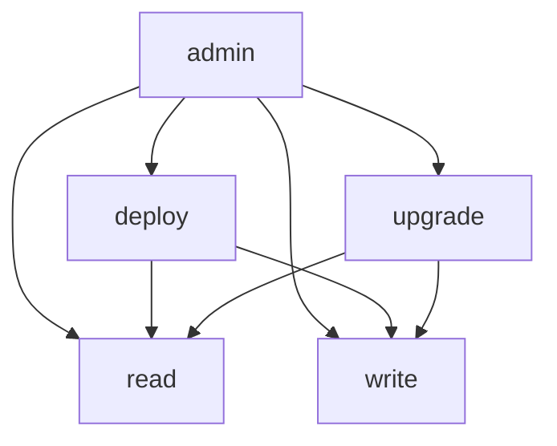
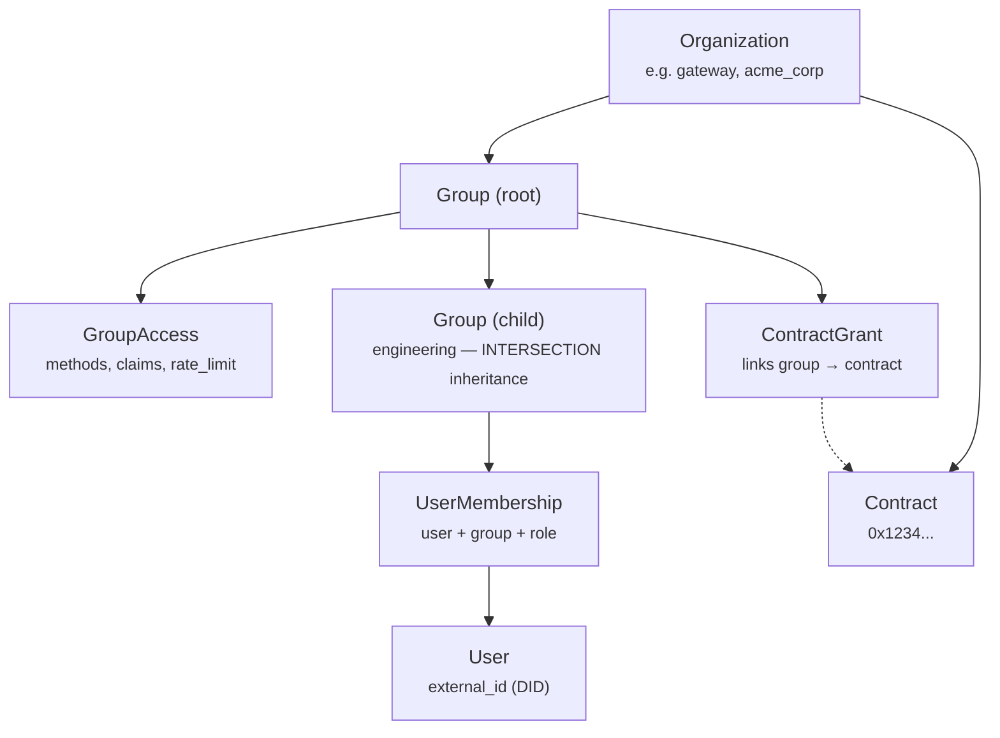
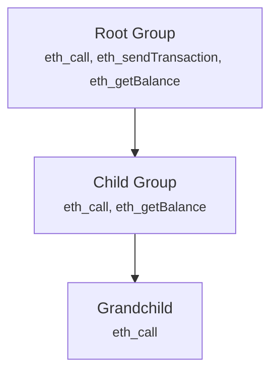

import { Callout } from "@/components/mdx/callout";
import { ApiEndpoint } from "@/components/mdx/api-endpoint";
export const metadata = {
  title: "RBAC",
  description:
    "Multi-tenant hierarchical role-based access control for blockchain node access.",
};

# Role-Based Access Control (RBAC)

## Overview

The Open Privacy Suite implements a **multi-tenant, hierarchical RBAC** system that protects blockchain
node access. Organizations define fine-grained permissions for users accessing JSON-RPC methods and
smart contracts.

**Key features:**

- **Multi-tenant** -- multiple independent organizations with isolated permission hierarchies
- **Hierarchical groups** -- nested groups with restrictive inheritance (children can only narrow parent permissions)
- **Dual membership** -- users can be assigned via admin API or ZK-attested credentials
- **Contract ownership** -- track deployed contracts and define owner capabilities
- **Caching** -- in-memory and database-level caching for high-performance access checks

---

## Simplified Permission Model (TL;DR)

The RBAC system uses a **group-centric claim model**:

1. **Groups have claims** -- each group defines capabilities (`read`, `write`, `deploy`, `admin`, `upgrade`) via `GroupAccess.claims`. This is the single source of truth.

2. **ContractGrants link groups to contracts** -- for registered contracts, a `ContractGrant` establishes which groups can access which contracts. The grant does NOT store claims; claims are inherited from the group.

3. **All contracts are private by default** -- unregistered addresses (not registered to any organization) are denied. Only EVM precompiles (0x01-0x09) are accessible without explicit registration. A contract registered to a *different* org is always denied regardless of the user's claims.

4. **Deploy/admin users have broad access** -- they can access any registered contract in their own org without needing explicit `ContractGrant` entries.

5. **Read/write users need explicit grants** -- they must have a `ContractGrant` linking their group to each contract they need to access.

6. **Org admins bypass everything** -- groups with `is_org_admin: true` give members all claims on all contracts in the organization.

| Contract Type | Deploy/Admin Users | Read/Write Users |
|--------------|-------------------|-----------------|
| Unregistered | **Denied** (private by default) | **Denied** (private by default) |
| EVM Precompile (0x01-0x09) | Allowed (read) | Allowed (read) |
| Registered (own org) | Allowed (default claims) | ContractGrant required |
| Registered (other org) | Denied (cross-org) | Denied (cross-org) |
| Self-deployed | Grant added to deployer's group | Grant added to deployer's group |
| Org admin member | All claims, all contracts | N/A |

---

## Claims Hierarchy

Claims are capability tokens that grant specific actions. Higher-level claims imply lower-level ones.



`ExpandClaims()` normalizes implied claims before saving on the backend.

| Claim | Purpose | Required For |
|-------|---------|--------------|
| `read` | Read blockchain state | `eth_call`, `eth_getBalance`, `eth_getCode`, etc. |
| `write` | Modify blockchain state | `eth_sendTransaction` (non-deployment) |
| `deploy` | Deploy new contracts | `eth_sendTransaction` with empty `to`, `eth_estimateGas` for deployment |
| `admin` | Full administrative access | All operations including deployment |
| `upgrade` | Upgrade proxy contracts | `upgradeTo()`, `upgradeToAndCall()` on managed proxies |

<Callout variant="info" title="Method-claim validation">

The system enforces consistency between allowed methods and claims. For example, allowing
`eth_sendTransaction` without the `write` claim returns a 400 Bad Request error.

</Callout>

---

## Architecture



### Key entities

- **Organization** -- top-level tenant with a unique slug, display name, and custom settings (JSONB)
- **Group** -- hierarchical permission container with parent/child relationships and a materialized path (e.g., `root.engineering.devops`)
- **GroupAccess** -- defines allowed methods, claims, and rate limits for a group
- **ContractGrant** -- links a group to a contract; optionally restricts callable functions via `FunctionRule` and parameter constraints via `ParamRule`
- **UserMembership** -- assigns a user to a group with a role
- **Role** -- named set of claims (e.g., "deployer" with `[read, write, deploy]`)

---

## Permission Evaluation Flow

<Callout variant="info" title="How permissions are computed">

1. **Group has claims** via GroupAccess: `{ claims: [read, write], methods: [...] }`
2. **Unregistered contracts**: denied (private by default). Only EVM precompiles (0x01-0x09) are accessible. All other contracts must be registered to an org.
3. **Registered contracts (own org)**: deploy/admin users allowed via default claims. Read/write users need a ContractGrant. Claims come from GroupAccess. Functions can be restricted via FunctionRule. Parameters can be constrained via ParamRule.
4. **Deployer contract grant**: when a user deploys a contract, a `contract_grant` is added to their existing deploy group. The admin must pre-create a group with the `deploy` claim and add deployers to it.
5. **Org admin bypass**: groups with `is_org_admin=true` get ALL claims on ALL contracts in the organization.

</Callout>

---

## Group Hierarchy and Restrictive Inheritance

Child groups can only **narrow** parent permissions, never expand them.



When computing effective permissions for a single membership:

1. Traverse from root to leaf group
2. Apply **INTERSECTION** for methods and contracts
3. Apply **UNION** for owned contracts (ownership propagates down)
4. Apply **MINIMUM** for rate limits (most restrictive wins)

### Multiple Memberships

A user can belong to multiple groups. Across memberships:

1. Compute permissions for each membership (restrictive inheritance within the chain)
2. Apply **UNION** across all memberships (user gets combined permissions)
3. Apply **MAXIMUM** for rate limits across memberships

---

## Contract Access Rules

### Function Selectors

For fine-grained control, `ContractGrant.Functions` can restrict which functions users can call on
a specific contract.

```json
{
  "functions": [
    { "selector": "0x70a08231" },
    { "selector": "0xa9059cbb", "param_rules": [{ "index": 0, "must_be": "self" }] }
  ]
}
```

Common ERC20 selectors:

| Selector | Function |
|----------|----------|
| `0xa9059cbb` | `transfer(address,uint256)` |
| `0x095ea7b3` | `approve(address,uint256)` |
| `0x70a08231` | `balanceOf(address)` |
| `0x23b872dd` | `transferFrom(address,address,uint256)` |

If `functions` is empty or null, all functions are allowed. Selectors are case-insensitive.
Inheritance uses INTERSECTION (child restrictions narrow parent).

### Parameter Constraints

Function rules can include `param_rules` to enforce constraints on individual call parameters:

- **Prerequisite:** the user's DID must be linked to an ETH address via EIP-191, and the contract must have its ABI uploaded
- **Constraint `"self"`:** the parameter (must be an `address` type) must match one of the caller's linked ETH addresses
- **Applies to:** `eth_sendTransaction`, `eth_call`, `eth_estimateGas`, `eth_sendRawTransaction`

<Callout variant="warning" title="Known limitations">

- `eth_getStorageAt` uses tiered access (admin: all slots, read: EIP-1967 proxy infrastructure slots only, no claim: blocked) which limits but does not fully prevent storage-level reads for users with the read claim -- the four allowed proxy slots expose implementation/admin addresses only
- Internal calls within contracts cannot be intercepted
- `eth_getLogs` topic filtering is not yet addressed
- Users without a linked ETH address cannot access functions with param constraints

</Callout>

### Multi-Organization Users

Users can be members of groups in multiple organizations. The system resolves organization context
based on the **target contract**:

| Target | Org Context | Behavior |
|--------|-------------|----------|
| Contract owned by Org A | Org A | Use Org A memberships |
| Contract owned by Org B | Org B | Use Org B memberships |
| Unregistered contract | -- | **Denied** (private by default) |
| EVM precompile (0x01-0x09) | N/A | Allowed (read access) |
| Contract in Org C (user not member) | -- | Request denied |
| No target (deployment) | User's default org | Use default org memberships |

**Note on "unregistered" contracts:** Contracts deployed through the proxy are **never unregistered** — they are pre-registered to the deployer's org before the transaction is forwarded to the node, closing any race window. All unregistered addresses are private by default. If a contract exists on-chain but was not deployed through the proxy (e.g., system/genesis contracts), it must be claimed via the admin API (`POST /orgs/:org_id/contracts/claim`) to become accessible.

---

## Rate Limiting

Each group can define rate limits:

- **`rate_limit_rps`** -- requests per second
- **`rate_limit_daily`** -- daily request cap

Within a group chain, the **minimum** (most restrictive) value applies. Across multiple
memberships, the **maximum** value applies.

---

## Per-Group RPC API Keys

Each group can optionally have an `rpc_api_key` configured via the admin API or admin dashboard. When a user's request is forwarded to the upstream RPC node, the proxy attaches the group's API key as a `Bearer` token in the `Authorization` header. This enables per-group rate limiting and usage tracking on the upstream RPC proxy side.

**Key behavior:**

- If a group has an `rpc_api_key`, it is used for all requests from members of that group
- If no group-specific key is set, the global `RPC_API_KEY` environment variable is used as a fallback
- Keys are encrypted at rest using AES-256-GCM when `RPC_API_KEY_ENCRYPTION_KEY` is configured (required in production)
- API keys are masked in admin API responses (only last 4 characters shown, e.g., `****c123`)
- When a user belongs to multiple groups, the key from the group that grants access to the target contract is used

**Circuit breaker protection:** If the upstream RPC node returns HTTP 429 (Too Many Requests) for a given API key, the proxy trips a per-key circuit breaker with a 1-second cooldown. During cooldown, all requests using that key are rejected immediately without forwarding, preventing cascade overload. See [Configuration](/docs/configuration#rpc-api-keys-and-upstream-rate-limiting) for details.

---

## API Endpoints

For full request/response details, see the [API Reference](/docs/api).

### Organizations

<ApiEndpoint method="GET" path="/api/orgs" description="List all organizations" />
<ApiEndpoint method="POST" path="/api/orgs" description="Create organization" />
<ApiEndpoint method="GET" path="/api/orgs/:org_id" description="Get organization" />
<ApiEndpoint method="PUT" path="/api/orgs/:org_id" description="Update organization" />

### Groups

<ApiEndpoint method="GET" path="/api/orgs/:org_id/groups" description="List groups" />
<ApiEndpoint method="POST" path="/api/orgs/:org_id/groups" description="Create group" />
<ApiEndpoint method="GET" path="/api/orgs/:org_id/groups/:id" description="Get group" />
<ApiEndpoint method="PUT" path="/api/orgs/:org_id/groups/:id" description="Update group" />
<ApiEndpoint method="DELETE" path="/api/orgs/:org_id/groups/:id" description="Delete group" />
<ApiEndpoint method="PUT" path="/api/orgs/:org_id/groups/:id/access" description="Set group access (methods, claims)" />

The list groups endpoint supports optional filters:
- `?search=term` — filter by name or slug (case-insensitive)

### Contract Grants

<ApiEndpoint method="POST" path="/api/orgs/:org_id/contracts/:address/grants" description="Link a group to a contract" />

### Roles and Memberships

<ApiEndpoint method="POST" path="/api/orgs/:org_id/roles" description="Create role with claims" />
<ApiEndpoint method="POST" path="/api/users/:id/memberships" description="Assign user to a group with a role" />
