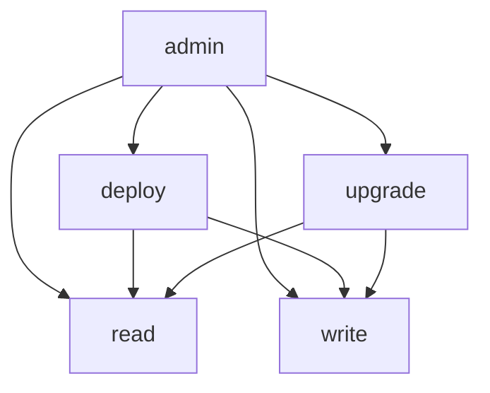
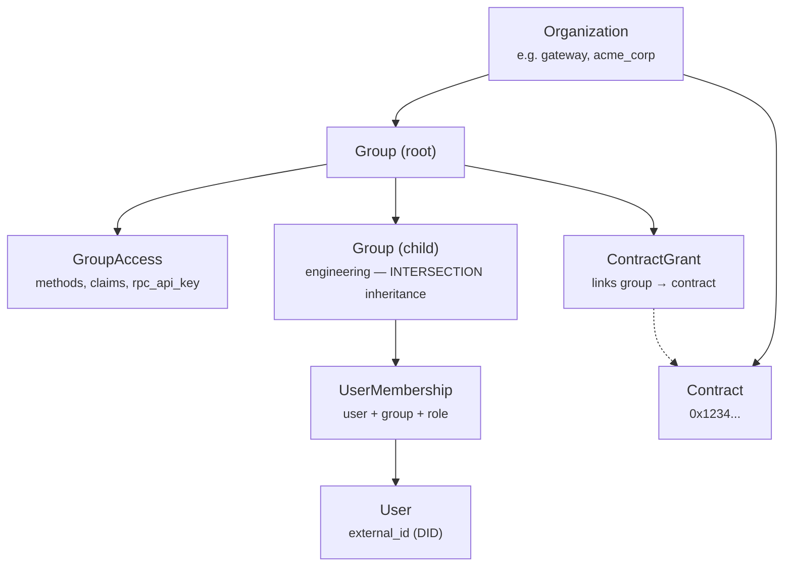
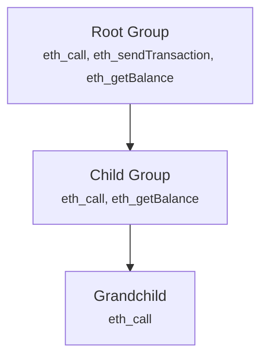

import { Callout } from "@/components/mdx/callout";
import { ApiEndpoint } from "@/components/mdx/api-endpoint";
export const metadata = {
  title: "RBAC",
  description:
    "Multi-tenant hierarchical role-based access control for blockchain node access.",
};

# Role-Based Access Control (RBAC)

## Overview

The Open Privacy Suite implements a **multi-tenant, hierarchical RBAC** system that protects blockchain
node access. Organizations define fine-grained permissions for users accessing JSON-RPC methods and
smart contracts.

**Key features:**

- **Multi-tenant** -- multiple independent organizations with isolated permission hierarchies
- **Hierarchical groups** -- nested groups with restrictive inheritance (children can only narrow parent permissions)
- **Dual membership** -- users can be assigned via admin API or ZK-attested credentials
- **Contract ownership** -- track deployed contracts and define owner capabilities
- **Caching** -- in-memory and database-level caching for high-performance access checks
- **Immediate propagation** -- permission changes (group access, memberships, contract grants) take effect immediately, no restart or cache wait required

---

## Simplified Permission Model (TL;DR)

The RBAC system uses a **two-layer permission model**: a method allowlist controls which RPC methods a group can call, and operational claims (`deploy`, `upgrade`, `admin`) gate specific high-privilege operations.

1. **Method allowlist is the source of truth for read/write** -- each group defines which RPC methods are permitted via `GroupAccess.allowed_methods`. If `eth_call` is not in the list, the user cannot call it. If `eth_sendTransaction` is not in the list, the user cannot send transactions.

2. **Operational claims gate privileged operations** -- only `deploy`, `upgrade`, and `admin` are claim-gated. Contract deployment requires the `deploy` claim. Proxy upgrades require the `upgrade` claim. The `admin` claim implies both.

3. **ContractGrants link groups to contracts** -- for registered contracts, a `ContractGrant` establishes which groups can access which contracts. The grant does NOT store claims; claims are inherited from the group.

4. **All contracts are private by default** -- unregistered addresses (not registered to any organization) are denied. Only EVM precompiles (0x01-0x09) are accessible without explicit registration. A contract registered to a *different* org is always denied regardless of the user's claims.

5. **Org admins bypass everything** -- groups with `is_org_admin: true` give members all claims on all contracts in the organization.

| Contract Type | Deploy/Admin Users | Standard Users |
|--------------|-------------------|----------------|
| Unregistered | **Denied** (private by default) | **Denied** (private by default) |
| EVM Precompile (0x01-0x09) | Allowed | Allowed |
| Registered (own org) | Allowed (default claims) | ContractGrant required |
| Registered (other org) | Denied (cross-org) | Denied (cross-org) |
| Self-deployed | Grant added to deployer's group | Grant added to deployer's group |
| Org admin member | All claims, all contracts | N/A |

---

## 3-Tier Admin Model

The system uses three tiers of administrative access, each scoped to a different level of the hierarchy.

### Tier 1: Super Admin

Configured via the `ADMIN_API_TOKEN` environment variable. This is not a user account -- it is a shared secret for cross-org access used by scripts and initial setup. Super admins can access the admin API for any organization.

### Tier 2: Org Admin

Groups with `is_org_admin` enabled. Scoped to their organization:

- Full admin dashboard access for their org
- Can manage groups, users, and contract grants
- Can create groups with any claims but **cannot create other org admin groups**
- Sees all contracts in their org in the block explorer
- Bypasses event rules for org contracts

### Tier 3: Contract Admin

Groups with the `admin` claim on specific contracts (via contract grants):

- Full access to granted contracts only (bypasses event rules, sees all storage)
- **No** admin dashboard access
- **No** org-wide visibility
- Cannot manage users or groups

### Escalation Prevention

No user can grant permissions at their own level or higher:

- Org admins cannot create org admin groups
- Contract admins cannot access the admin API
- Only super admins can grant org admin status

---

## Claims Hierarchy

Claims are capability tokens that grant specific actions. Higher-level claims imply lower-level ones.



`ExpandClaims()` normalizes implied claims before saving on the backend.

| Claim | Purpose | Required For |
|-------|---------|--------------|
| `deploy` | Deploy new contracts | `eth_sendTransaction` with empty `to`, `eth_estimateGas` for deployment |
| `admin` | Full administrative access | All operations including deployment; implies `deploy` + `upgrade` |
| `upgrade` | Upgrade proxy contracts | `upgradeTo()`, `upgradeToAndCall()` on proxy contracts |

Read and write access is controlled entirely by the method allowlist. If `eth_call` is in a group's allowed methods, members can read contract data. If `eth_sendTransaction` is in the list, members can send transactions. No additional claim is needed.

<Callout variant="info" title="Method-claim validation">

The system enforces consistency between allowed methods and claims. For example, allowing
`debug_traceTransaction` without the `deploy` claim returns a 400 Bad Request error.
Read/write methods do not require claims.

</Callout>

---

## Architecture



### Key entities

- **Organization** -- top-level tenant with a unique slug, display name, and custom settings (JSONB)
- **Group** -- hierarchical permission container with parent/child relationships and a materialized path (e.g., `root.engineering.devops`)
- **GroupAccess** -- defines allowed methods, claims, and an optional RPC API key for a group
- **ContractGrant** -- links a group to a contract; optionally restricts callable functions via `FunctionRule` and parameter constraints via `ParamRule`
- **UserMembership** -- assigns a user to a group with a role
- **Role** -- named set of claims (e.g., "deployer" with `[deploy]`)

---

## Permission Evaluation Flow

<Callout variant="info" title="How permissions are computed">

1. **Group has methods + claims** via GroupAccess: `{ methods: [...], claims: [deploy] }`. The method list controls read/write; claims gate deployment and upgrades.
2. **Unregistered contracts**: denied (private by default). Only EVM precompiles (0x01-0x09) are accessible. All other contracts must be registered to an org.
3. **Registered contracts**: require a `ContractGrant` on the user's group. The `admin` and `deploy` claims alone do **not** unlock registered contracts — tier 3 admins get RBAC bypass only on contracts explicitly granted to their group (per the 3-tier admin model). Functions can be restricted via `FunctionRule`. Parameters can be constrained via `ParamRule`.
4. **Deployer contract grant**: when a user deploys a contract, a `contract_grant` is added to their existing deploy group. The admin must pre-create a group with the `deploy` claim and add deployers to it.
5. **Org admin bypass**: groups with `is_org_admin=true` (tier 2) get ALL claims on ALL contracts in the organization — this is how org admins see every org contract at both the RPC and explorer layers.

<Callout variant="info" title="Access/visibility symmetry">
RPC access and explorer visibility share the same grant model. If a user can call a contract via RPC, they see it as **Full** in the explorer; if they cannot call it, it shows as `[PRIVATE]` or is hidden. Any asymmetry is a bug — the invariant is enforced by the `TestAccessVisibilitySymmetry` integration test.
</Callout>

</Callout>

---

## Group Hierarchy and Restrictive Inheritance

Child groups can only **narrow** parent permissions, never expand them.



When computing effective permissions for a single membership:

1. Traverse from root to leaf group
2. Apply **INTERSECTION** for methods and contracts
3. Apply **UNION** for owned contracts (ownership propagates down)

### Multiple Memberships

A user can belong to multiple groups. Across memberships:

1. Compute permissions for each membership (restrictive inheritance within the chain)
2. Apply **UNION** across all memberships (user gets combined permissions)

---

## Contract Access Rules

### Function Selectors

For fine-grained control, `ContractGrant.Functions` can restrict which functions users can call on
a specific contract.

```json
{
  "functions": [
    { "selector": "0x70a08231" },
    { "selector": "0xa9059cbb", "param_rules": [{ "index": 0, "must_be": "self" }] }
  ]
}
```

Common ERC20 selectors:

| Selector | Function |
|----------|----------|
| `0xa9059cbb` | `transfer(address,uint256)` |
| `0x095ea7b3` | `approve(address,uint256)` |
| `0x70a08231` | `balanceOf(address)` |
| `0x23b872dd` | `transferFrom(address,address,uint256)` |

If `functions` is empty or null, all functions are allowed. Selectors are case-insensitive.
Inheritance uses INTERSECTION (child restrictions narrow parent).

### Parameter Constraints

Function rules and event rules can include `param_rules` to enforce constraints on individual parameters:

- **Prerequisite:** the contract must have its ABI uploaded (or a `token_type` set for built-in ABI fallback)
- **Constraint `"self"`:** the parameter (must be an `address` type) must match one of the caller's linked ETH addresses
- **Custom hex addresses:** for event rules, a literal `0x...` address can be specified to filter events by a specific party. Custom hex addresses are subject to **cross-org boundary enforcement** (see below)
- **Function param_rules apply to:** `eth_sendTransaction`, `eth_call`, `eth_estimateGas`, `eth_sendRawTransaction`
- **Event param_rules apply to:** `eth_getLogs`, `eth_getTransactionReceipt` (log filtering)

#### Cross-Org Boundary Enforcement

Custom hex addresses in event param rules are validated at grant creation and update time:

- **Same-org addresses:** allowed (contracts, preregistered addresses, or EOAs linked to users in the grant's organization)
- **Cross-org addresses:** rejected — addresses belonging to a different organization cannot be referenced
- **Unregistered addresses:** rejected (fail-closed) — addresses not verifiably belonging to the grant's organization are denied
- **Multi-org users:** if an EOA is linked to a user who belongs to multiple organizations, the address is allowed if any of those organizations matches the grant's organization

This prevents an admin from configuring event rules that target users or contracts in other organizations, which would bypass the disclosure request flow.

<Callout variant="warning" title="Known limitations">

- `eth_getStorageAt` uses tiered access (admin: all slots, non-admin: EIP-1967 proxy infrastructure slots only) which limits but does not fully prevent storage-level reads -- the four allowed proxy slots expose implementation/admin addresses only
- Internal calls within contracts cannot be intercepted
- Users without a linked ETH address cannot access functions with param constraints

</Callout>

### Multi-Organization Users

Users can be members of groups in multiple organizations. The system resolves organization context
based on the **target contract**:

| Target | Org Context | Behavior |
|--------|-------------|----------|
| Contract owned by Org A | Org A | Use Org A memberships |
| Contract owned by Org B | Org B | Use Org B memberships |
| Unregistered contract | -- | **Denied** (private by default) |
| EVM precompile (0x01-0x09) | N/A | Allowed (read access) |
| Contract in Org C (user not member) | -- | Request denied |
| No target (deployment) | User's default org | Use default org memberships |

**Note on "unregistered" contracts:** Contracts deployed through the proxy are **never unregistered** — they are pre-registered to the deployer's org before the transaction is forwarded to the node, closing any race window. All unregistered addresses are private by default. If a contract exists on-chain but was not deployed through the proxy (e.g., system/genesis contracts), it must be claimed via the admin API (`POST /orgs/:org_id/contracts/claim`) to become accessible.

---

## Rate Limiting

Rate limiting is handled at the **RPC proxy API key level**, not per-group. Each group can have an
`rpc_api_key` that maps to rate limit tiers configured on the upstream RPC proxy. See the
[Per-Group RPC API Keys](#per-group-rpc-api-keys) section below for details.

---

## Per-Group RPC API Keys

Each group can have an `rpc_api_key` configured via the admin dashboard. This key is used when forwarding requests to the upstream RPC node, enabling per-group rate limiting and usage tracking.

- If a group has an API key, it is used for all requests from members of that group
- If no group-specific key is set, the global `RPC_API_KEY` is used as a fallback
- Keys are encrypted at rest in production (`RPC_API_KEY_ENCRYPTION_KEY` required)
- API keys are masked in API responses (only last 4 characters visible)

### Custom API Key Header

By default the API key is sent as `Authorization: Bearer <key>`. Some upstream RPC providers expect the key under a different header name (commonly `X-API-Key`). Both the global default and per-group override are configurable:

- Global default: `RPC_API_KEY_HEADER` (env var, default `Authorization`).
- Per-group override: `rpc_api_key_header` on each group's access settings.

Resolution order at request time: per-group value (if non-empty) → `RPC_API_KEY_HEADER` env var → `Authorization`.

Behaviour:

- When the resolved header is `Authorization` (case-insensitive), the proxy sends `Authorization: Bearer <key>` — preserving the historical format.
- For any other header name, the proxy sends the API key verbatim, e.g. `X-API-Key: <key>` (no `Bearer` prefix).

Header names are validated against `^[A-Za-z0-9-]+$` at save time to prevent header injection. Invalid values are rejected with `400 Bad Request`.

See [Configuration](/docs/configuration) for setup.

---

## API Endpoints

For full request/response details, see the [API Reference](/docs/api).

### Organizations

<ApiEndpoint method="GET" path="/api/orgs" description="List all organizations" />
<ApiEndpoint method="POST" path="/api/orgs" description="Create organization" />
<ApiEndpoint method="GET" path="/api/orgs/:org_id" description="Get organization" />
<ApiEndpoint method="PUT" path="/api/orgs/:org_id" description="Update organization" />

### Groups

<ApiEndpoint method="GET" path="/api/orgs/:org_id/groups" description="List groups" />
<ApiEndpoint method="POST" path="/api/orgs/:org_id/groups" description="Create group" />
<ApiEndpoint method="GET" path="/api/orgs/:org_id/groups/:id" description="Get group" />
<ApiEndpoint method="PUT" path="/api/orgs/:org_id/groups/:id" description="Update group" />
<ApiEndpoint method="DELETE" path="/api/orgs/:org_id/groups/:id" description="Delete group" />
<ApiEndpoint method="PUT" path="/api/orgs/:org_id/groups/:id/access" description="Set group access (methods, claims)" />

The list groups endpoint supports optional filters:
- `?search=term` — filter by name or slug (case-insensitive)

### Contract Grants

<ApiEndpoint method="POST" path="/api/orgs/:org_id/contracts/:address/grants" description="Link a group to a contract" />

### Roles and Memberships

<ApiEndpoint method="POST" path="/api/orgs/:org_id/roles" description="Create role with claims" />
<ApiEndpoint method="POST" path="/api/users/:id/memberships" description="Assign user to a group with a role" />

## Admin dry-run / impersonation

Tier-2 org admins can ask the proxy "what would user X see if they made this RPC call?" without ever creating an impersonation token, mutating chain state, or exposing any data they don't already have.

<ApiEndpoint method="POST" path="/api/orgs/:org_id/dry-run" description="Dry-run an RPC call as another user (admin diagnostic)" />

### Who can call it

- **Tier-2 org admin** in `:org_id` — yes, via JWT.
- **Super-admin** (`X-Admin-Token`) — **no**, rejected with 403. Super-admin manages admins; this endpoint is for inspecting user-shaped views, which super-admin doesn't otherwise have data-layer reach into.
- **Tier-3 admin** (per-contract admin claim, no `is_org_admin`) — no, rejected by org-scoping middleware.
- **Read-Only Admin** (when shipped) — no.

### Request

```json
POST /api/orgs/:org_id/dry-run
{
  "user_did": "did:example:bob",
  "rpc": {
    "method": "eth_sendTransaction",
    "params": [{ "from": "0xbob...", "to": "0xcontract...", "data": "0xabcd" }]
  }
}
```

### Response

```json
{
  "decision": "allow" | "deny",
  "reason":   "...",
  "response": <redacted-as-user response, for read methods>,
  "trace":    <debug_traceCall output, for write methods>,
  "logs_emitted":          [...],
  "logs_visible_to_user":  [...]
}
```

Read methods (`eth_call`, `eth_getLogs`, `eth_getTransactionReceipt`, `eth_getTransactionByHash`, `eth_getBalance`, `eth_getCode`, `eth_getStorageAt`, `eth_blockNumber`, `eth_chainId`) pass through to the upstream node and return the user's would-be response.

Write methods (`eth_sendTransaction`) are translated to `debug_traceCall` against the upstream node — current state, no commit. The trace returns nested call frames + emitted logs; the proxy walks the frames and runs the logs through the impersonated user's RBAC view, returning both the full event list (`logs_emitted`) and the subset the user would actually see (`logs_visible_to_user`).

### Operational requirements

- The upstream node must expose `debug_traceCall` for write-method dry-run to work (Geth: `--http.api debug`). If unavailable, write-method calls return a clear error; read methods continue to work.
- All dry-run calls are recorded in the `impersonation_log` table with the actor's DID, the impersonated user's DID, the method, a SHA-256 hash of the params (raw params are never persisted), the decision, and a correlation ID. Operators are expected to forward this log to their SIEM via the existing `audit-forwarder` integration.
- Dry-run results have no side effects on chain state, no caching that would survive past the request, and no JWT minting at any point. The "impersonated" identity exists only inside one request handler.

### Limitations

- Cross-org impersonation is structurally blocked (admin in Org A can only dry-run users with a membership in Org A).
- `eth_sendRawTransaction` translation is not yet implemented; admins can decode and resubmit as `eth_sendTransaction` for dry-run purposes.
- A "View as user" dashboard mode (continuous browse-as) is tracked under RD-872 Phase 2 and not part of this release.
