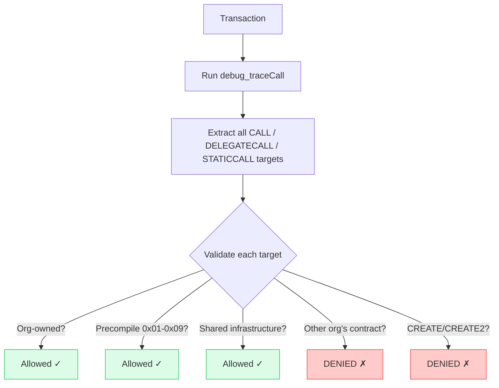
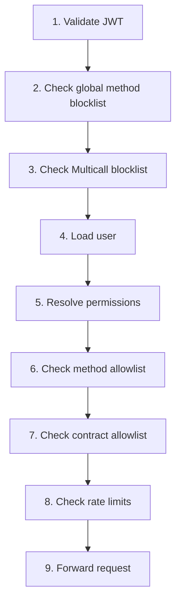

import { Callout } from "@/components/mdx/callout";
export const metadata = {
  title: "Security Features",
  description:
    "Request filtering, cross-organization isolation, authentication, authorization, and admin API protection in the Privacy Proxy.",
};

# Security Features

The Privacy Proxy implements defense-in-depth security across every layer of the request pipeline. This page covers request filtering, cross-org isolation, authentication and authorization security, admin API protection, and production hardening.

---

## Request Filtering

### Global Method Blocklist

Dangerous JSON-RPC methods are blocked regardless of user permissions:

| Method Pattern | Reason |
|----------------|--------|
| `debug_*` | Tracing/debugging (info disclosure, DoS) |
| `admin_*` | Node administration |
| `personal_*` | Account management (key exposure) |
| `miner_*` | Mining control |
| `txpool_*` | Mempool inspection (MEV risk) |
| `clique_*` | Consensus manipulation |
| `les_*` | Light client protocol |
| `eth_sign` | Arbitrary message signing |
| `eth_signTransaction` | Transaction signing |
| `eth_subscribe` | WebSocket subscriptions (bypasses filtering) |
| `eth_unsubscribe` | WebSocket subscriptions |

### eth\_sendRawTransaction Support

`eth_sendRawTransaction` is supported **only when runtime tracing is enabled** (`ENABLE_RUNTIME_TRACING=true`).

When runtime tracing is enabled, the proxy:

1. **Decodes the RLP transaction** to extract `from`, `to`, `data`, and `value` fields
2. **Recovers the sender address** from the transaction signature using the chain ID
3. **Runs full RBAC access checks** using the extracted transaction fields
4. **Executes runtime trace validation** via `debug_traceCall` to validate all call targets
5. **Forwards the raw transaction** to the node only if all checks pass

When runtime tracing is **disabled**, `eth_sendRawTransaction` is blocked with a 403 error.

### Batch Request Prevention

JSON-RPC batch requests (`[{...},{...}]`) are rejected outright. This prevents:

- Bypassing per-method access control
- Amplification attacks
- Hidden dangerous method calls within a batch

### Multicall Detection

Calls to known Multicall contracts are blocked because they allow batching arbitrary contract calls, bypassing method-level restrictions:

| Contract | Address |
|----------|---------|
| Multicall3 | `0xcA11bde05977b3631167028862bE2a173976CA11` |
| Multicall2 | `0x5ba1e12693dc8f9c48aad8770482f4739beed696` |
| Multicall1 | `0xeefba1e63905ef1d7acba5a8513c70307c1ce441` |

### Contract Deployment Protection

Contract deployments require the `deploy` claim:

| Method | Deployment Detection | Validation |
|--------|---------------------|------------|
| `eth_sendTransaction` | Missing/empty/null `to` field | Requires `deploy` claim + pre-registers address |
| `eth_estimateGas` | Missing/empty/null `to` field | Requires `deploy` claim |

**Bytecode validation** is performed on deployments:

- No CREATE/CREATE2 opcodes (prevents nested deployments)
- All static CALL targets must be org-owned or precompiles

When `ENABLE_RUNTIME_TRACING=true` (the default), dynamic calls are allowed at deployment because they are validated at runtime via transaction tracing.

### Runtime Transaction Validation

When `ENABLE_RUNTIME_TRACING=true`, every transaction is traced using `debug_traceCall` before being forwarded to the node:

**Benefits:**

- Catches all internal calls, including from custom multicall contracts
- Validates dynamic DELEGATECALL targets that cannot be known at deployment
- Provides comprehensive cross-org isolation
- Defense-in-depth alongside bytecode validation

**Performance:** approximately 50--200 ms additional latency per transaction. Tiered validation skips tracing for calls to known org-owned addresses.

---

## Cross-Organization Isolation

### Organization Context Resolution

When a user accesses a contract:

1. The system looks up which organization owns the target contract
2. Verifies the user has membership in that organization
3. Uses that organization's permission context for access checks

### Isolation Rules

- Users can only access contracts owned by organizations they belong to
- Unregistered contracts (no registered owner) are accessible only to users with `deploy` or `admin` claims -- the deploy-claim fallback only fires when `ownerOrgID == ""`
- A contract registered to another org is **always denied**, regardless of the requester's claims
- Deploy/admin users can access registered contracts in their own org via default claims (no explicit grant needed)
- Regular `read`/`write` users must have an explicit `ContractGrant`

### Plain CREATE Pre-registration

When a user with the `deploy` claim sends `eth_sendTransaction` without a `to` address (plain CREATE deployment), the proxy:

1. Computes the deterministic CREATE address from `keccak256(rlp([sender, nonce]))` before forwarding
2. Pre-registers the address to the deployer's organization immediately, closing the cross-org access window
3. Forwards the transaction to the node
4. On successful mining: finalizes the pre-registration as a full `Contract` record (`auto_registered: true`, `via: plain_create`)
5. On revert or failure: deletes the pre-registration

This ensures that from the moment the transaction is forwarded, the freshly deployed address belongs to the deployer's org and cannot be accessed by users in other organizations.

### Multi-Organization Users

Users can be members of multiple organizations. The system:

1. Determines org context from target contract ownership
2. Loads permissions from the correct organization
3. Rejects requests where the target contract belongs to an org the user is not a member of

### eth\_getLogs Cross-Org Protection

- All addresses in the filter are validated against org membership
- Mixed-org address filters are rejected
- Requests without an address filter are rejected

---

## Authentication Security

### ZK-Proof Verification

- Privado ID JWZ tokens are cryptographically verified
- Proofs are bound to specific authorization requests
- Cannot be replayed to other verifiers
- Session TTL prevents stale proofs

### JWT Token Security

| Feature | Implementation |
|---------|----------------|
| Signing | HS256 with strong secrets |
| Access TTL | 30 minutes |
| Refresh TTL | 7 days |
| Token rotation | Refresh tokens rotated on use |
| Revocation | Blacklist stored in database |

### ETH Address Linking Security

- One-time nonce challenges with a 5-minute TTL
- EIP-191 signature verification
- Challenge bound to the user's DID
- Nonce consumed on verification

---

## Authorization Security

### RBAC Model

- **Restrictive inheritance**: child groups can only narrow permissions
- **Multi-membership**: union of permissions across memberships
- **Expiring memberships**: optional expiration timestamps
- **Immutable audit log**: all changes tracked

### Access Control Flow

### Rate Limiting

- Per-user sliding window (requests per second)
- Per-user daily counter (resets at UTC midnight)
- Limits configurable per group
- Returns HTTP 429 when exceeded

---

## Admin API Protection

Admin endpoints (`/api/v1/admin/*`, `/api/admin/*`) are protected by three independent layers:

1. **Localhost-only middleware** -- requests must originate from private networks (`127.0.0.1`, `10.0.0.0/8`, `172.16.0.0/12`, `192.168.0.0/16`, `100.64.0.0/10`). Guards against external callers. Uses the raw TCP peer address, not `X-Forwarded-For`.
2. **`X-Admin-Token` header** -- M2M / bootstrap authentication. Timing-safe comparison via `crypto/subtle.ConstantTimeCompare`. Required in production.
3. **JWT with admin claim** -- browser-based admin access. The middleware validates the JWT, looks up the user, checks ban status, then queries `HasAdminClaim()` which joins `user_memberships → group_access` and filters expired memberships.

The middleware tries these in order: X-Admin-Token first, then JWT Bearer token. If neither is present and `ADMIN_API_TOKEN` is unset (dev mode only), requests pass through.

<Callout variant="warning" title="Why both layers?">
  The localhost check is the first gate but can be bypassed by a misconfigured reverse proxy that forwards external traffic on localhost, an SSRF vulnerability, or another container on the same Docker network. The token/JWT is the backstop when the network gate fails.
</Callout>

<Callout variant="danger" title="Production requirement">
  Set `ADMIN_API_TOKEN` to a strong random secret (32+ characters). Never pass this token to the frontend as a `VITE_*` environment variable -- Vite bakes env vars into the JS bundle, exposing them to every visitor. For browser-based admin access, users authenticate via Privado ID or Azure AD and receive a JWT with an admin RBAC claim.
</Callout>

### Frontend Admin Gate

The admin dashboard (`/admin/*`) is protected client-side by two nested components:

1. **`RequireAuth`** -- redirects unauthenticated users to `/login`
2. **`RequireAdmin`** -- calls `/api/v1/me/admin-status` to verify the user has the admin claim server-side. Non-admin users see an "Access Denied" page.

The frontend gate is a UX convenience. The actual security boundary is the backend `adminAuthMiddleware` -- admin API calls without valid credentials are rejected regardless of what the frontend shows.

### Nginx Security Headers

The production and E2E nginx configs include:

- `X-Frame-Options: DENY` -- prevents clickjacking
- `X-Content-Type-Options: nosniff` -- prevents MIME-type sniffing
- `Content-Security-Policy` -- restricts script/style/connect sources to same origin
- `Referrer-Policy: strict-origin-when-cross-origin`
- `Permissions-Policy` -- disables camera, microphone, geolocation, payment

### Azure AD Tenant Pinning

When a user first authenticates via Azure AD, their `auth_tenant_id` is set in the database. This field is **immutable after first assignment** -- enforced at the SQL level (`UPDATE ... WHERE auth_tenant_id IS NULL`). If a user later attempts to log in from a different Azure AD tenant, the request is rejected with HTTP 403. When an Azure AD tenant is deleted from the allowlist, all users bound to that tenant are automatically banned and their refresh tokens revoked.

### Trusted Proxies

`X-Forwarded-For` headers are only trusted from:

- `127.0.0.1`
- `172.16.0.0/12` (Docker networks)

---

## Production Checklist

- [ ] Set strong, unique `JWT_SECRET` and `JWT_REFRESH_SECRET`
- [ ] Set `ENVIRONMENT=production`
- [ ] Configure `VERIFIER_ID` with your Privado DID
- [ ] Set `BASE_URL` to public HTTPS URL
- [ ] Set `ADMIN_API_TOKEN` to a strong random secret (32+ chars)
- [ ] Enable `REQUIRE_PROOF_OF_HUMANITY` if using Billions
- [ ] Configure PostgreSQL with SSL (`sslmode=require`)
- [ ] Place behind reverse proxy with TLS termination
- [ ] Restrict admin API access at network level
- [ ] Set up log aggregation for audit trail
- [ ] Configure rate limits appropriate for your use case
- [ ] If using `SIEM_WEBHOOK_URL`: ensure the endpoint is covered by a data processing agreement (audit events contain user DIDs and IP addresses, which are PII under GDPR)
- [ ] If using `AUDIT_LOG_PARAMS=true`: review which RPC methods your users call (params for methods not explicitly handled by `RedactParams` are logged verbatim)

---

## Known Limitations

| Area | Limitation | Mitigation |
|------|------------|------------|
| Parameter validation | Only method/contract validated | Upstream node validation |
| Token revocation | Database lookup per request | Consider Redis for high volume |
| Multicall | Only 3 hardcoded addresses blocked | Mitigated by runtime tracing (all calls validated regardless of target) |
| Method case sensitivity | Methods checked case-sensitively | Ethereum nodes typically reject wrong case |
| Localhost IP ranges | `172.x` prefix check is overly broad | See SECURITY\_FINDINGS.md for fix |
| Historical state | Only `eth_call`/`eth_getStorageAt` blocked | Other methods (`eth_getBalance`) accept historical blocks |
